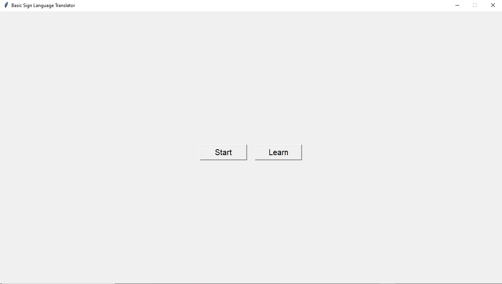
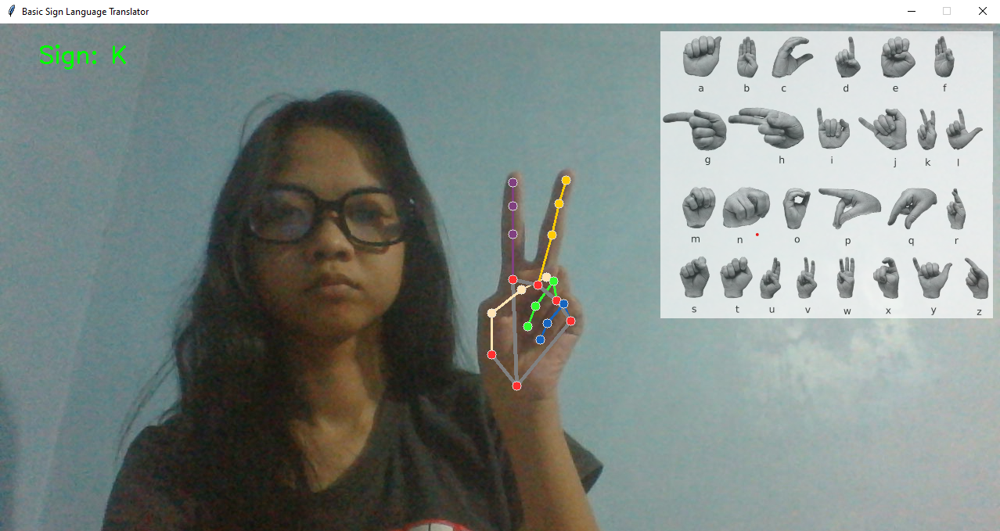
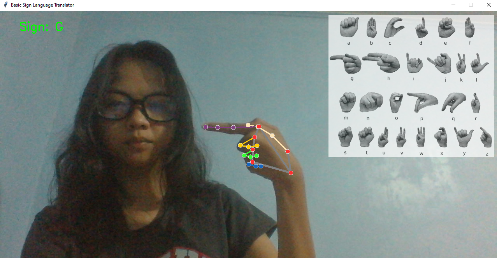
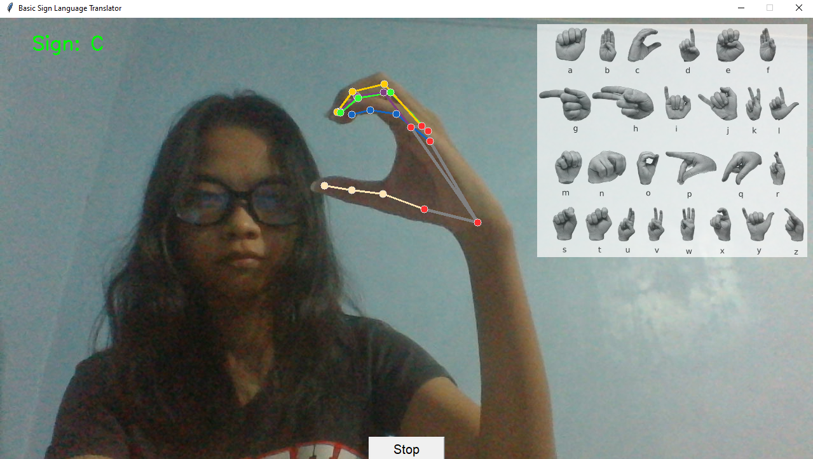

## ✌️**GESTURA**
Basic Sign Language Translator

---

## 📖 **OVERVIEW**

**Gestura** is a system that allows anyone to learn, interpret, as well as to communicate effectively through sign language. This system utilizes the camera which can provide hand language translations with just the gesture and motion of the hand. The system also offers an educational guide that can further help with understanding hand signs easier.

---

## ⚙️ **SYSTEM ARCHITECTURE**

As mentioned above, the system uses the device camera to track hand gesutres. Whenever a hand is visible in a camera, the system automatically assign landmarks or key points to certain parts of the hand. These key points determine coordinates, and specific coordinates that represent sign language letters are then translated once the system recognizes it. 

Furthermore, the system employs a trained model which can detect coordinates and present a very accurate translation based on the extracted set of coordinates. In order for the trained model to perform correctly and provide accurate outputs, extensive amounts of data was required to be fed to the model. A program similar to the system that detects hands and assigns coordinates were used to collect data easily. This program captured five sets of hand gesture coordinates for each letter translation in the American Sign Language (ASL). The data gathered was compiled into a comma-separated value (CSV) file which was then recognized and learned by the model in order to have a high percentage of successful performance. 

---

## 📝 **HOW TO RUN THE PROJECT**
1. **Prerequisites**  
   - Ensure to install and use Python version 3.8.10 specifically on your system.  
   - Download or clone the Gestura project files from this repository.

2. **Installing Dependencies**  
   - Open a terminal and type this command to install the necessary packages:  
     ```
     pip install opencv-python mediapipe numpy pandas scikit-learn
     ```

       - ✅ **opencv-python** → For real-time webcam input & display.
       - ✅ **mediapipe** → For hand tracking & landmark extraction.
       - ✅ **numpy** → For numerical operations on landmark data.
       - ✅ **pandas** → For handling CSV data.
       - ✅ **scikit-learn** → For training & using the SVM model.

3. **Running the Project**  
   - Once everything is prepared, run the <ins>main.py</ins> file.

---

## 📷 **APP PREVIEW**






##  <a id = "contrib"> 👷‍ CONTRIBUTORS </a> <br>

| Name | E-mail |
| --- | --- |
| <a href = "https://github.com/maryflorrr">Maryflor Campued</a>| maryflorcampued08@gmail.com  |
| <a href = "https://github.com/Nathnath95"> Nathaniel Lejano</a>| nathnath9536@gmail.com |
| <a href = "https://github.com/VinceAbella"> Vince Jericho Abella </a>| vinceabella07@gmail.com |  

---

## 🤝 **ACKNOWLEDGEMENT**

We are incredibly grateful to **Ms. Fatima Marie P. Agdon, MSCS** for being more than just a mentor but also a true guiding light throughout this journey. Your hands-on approach and unwavering support have made learning both exciting and meaningful.Your patience, wisdom, and encouragement have not only helped us build this project but have also shaped us into more confident and capable individuals. Your passion for teaching and dedication to your students inspire us every day. From the bottom of our hearts, thank you for your kindness, guidance, and for always believing in us.
